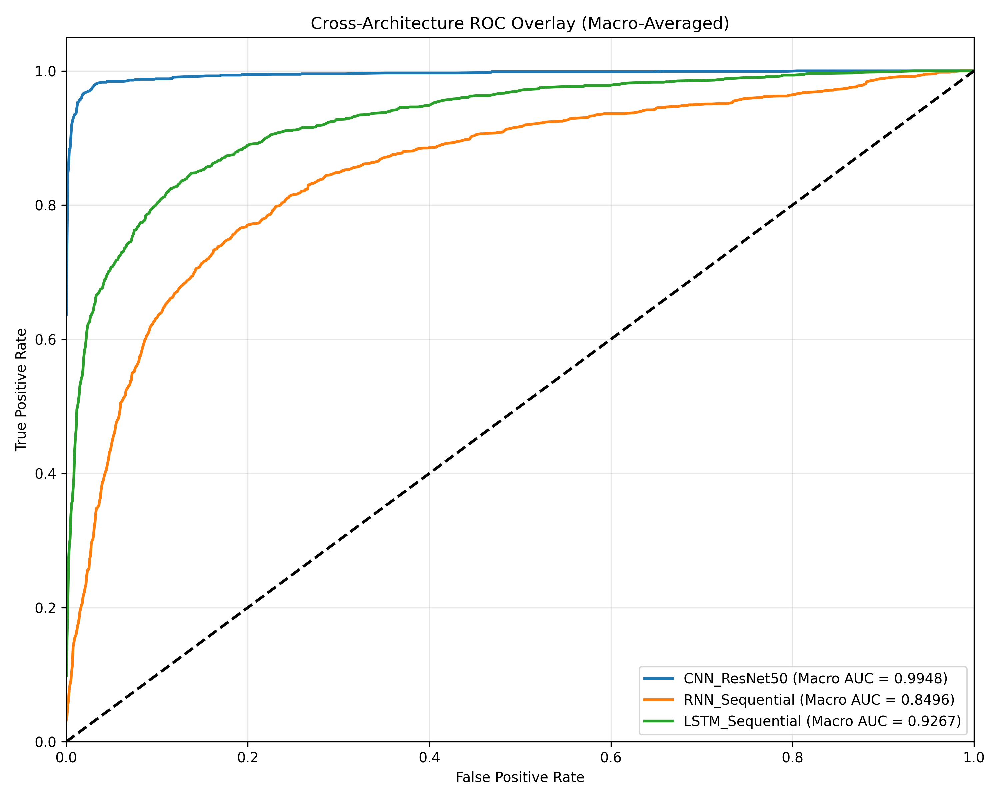

# NexGen NeuroVision: Diagnostic MLOps Pipeline

**Lead Engineer:** Saad Ullah

## Overview
NexGen NeuroVision is a pipeline engineered to classify brain tumor topologies from raw magnetic resonance imaging (MRI) scans. The project serves as an empirical demonstration of spatial vs. sequential feature extraction, culminating in a production ready, containerized diagnostic web application.

The core objective was to push beyond standard transfer learning by fully fine tuning a deep residual network and deploying the optimized weights via an ONNX runtime engine to a Next.js clinical dashboard.

## Dataset & Preprocessing Architecture
The models ingest the Brain Tumor Classification dataset (Kaggle), consisting of 7,200 perfectly balanced MRI scans across four classes: **Glioma, Meningioma, Pituitary, and No Tumor**. 

*   **Split Strategy:** 66% Training, 12% Validation, 22% Holdout Test.
*   **Spatial Augmentation:** The training pipeline utilizes dynamic transformations (random horizontal flips, rotational shifts, and color jitter) to prevent overfitting and enforce spatial generalization.
*   **Normalization:** Tensors are standardized against strict ImageNet distribution metrics.

## Neural Architectures
To test mathematical approaches to image processing, three distinct paradigms were engineered using PyTorch:

1.  **Convolutional Neural Network (Fine Tuned ResNet50)**
    Rather than freezing the ImageNet backbone, the entire 24 million parameter network was unfrozen. Paired with a `ReduceLROnPlateau` scheduler and a micro learning rate, the network learned the specific micro textures of brain tissue without catastrophic forgetting.
2.  **Long Short-Term Memory (LSTM)**
    Images were flattened into 224-step sequences to test sequential processing. Memory gates retained information from the top of the scan while processing the bottom.
3.  **Recurrent Neural Network (RNN)**
    A standard sequential baseline lacking advanced memory gating mechanisms.

## Empirical Validation
Flattening an image into a linear sequence fundamentally destroys the localized geometric context required to define tumor boundaries. The fine-tuned CNN preserved this spatial geometry natively, achieving clinical grade reliability.

| Architecture | Accuracy | Precision | Recall | F1 Score | Parameters |
| :--- | :--- | :--- | :--- | :--- | :--- |
| **CNN ResNet50** | **95.5%** | **0.958** | **0.955** | **0.953** | **24,033,604** |
| LSTM Sequential | 77.1% | 0.766 | 0.771 | 0.759 | 551,236 |
| RNN Sequential | 65.3% | 0.626 | 0.653 | 0.620 | 144,196 |



## Full-Stack Deployment Architecture
The repository extends beyond notebook training into a decoupled, production-ready web application. 

*   **Inference Backend (FastAPI):** The trained PyTorch state dictionary is compiled into a static ONNX execution graph. The Python backend processes incoming REST payloads, computes Grad-CAM activation maps for lesion localization, and extracts dynamic bounding boxes.
*   **Client Interface (Next.js):** A highly responsive, glassmorphism UI built with Tailwind CSS. It manages the drag-and-drop diagnostic node, visualizes the activation heatmaps, and provides automated client-side PDF clinical report generation.
*   **Orchestration (Docker):** The entire stack is containerized via `docker-compose`, with dynamic port binding for seamless CI/CD integration into cloud environments like Render.

## Project Structure
```text
NexGen-NeuroVision/
├── api/                     # FastAPI ONNX Inference Node
├── data/
│   ├── raw/                 # Raw Kaggle images
│   └── processed/           # Transformed tensors
├── frontend/                # Next.js Clinical Dashboard
├── notebooks/
│   └── execution_engine.ipynb
├── outputs/
│   ├── models/              # Compiled ONNX Engines & .pth Weights
│   ├── plots/               # Confusion matrices and ROC curves
│   └── reports/             # Telemetry & Validation CSVs
├── src/
│   ├── data/
│   │   └── dataset.py       # PyTorch Dataset and DataLoader logic
│   ├── models/
│   │   ├── cnn.py
│   │   ├── lstm.py
│   │   └── rnn.py
│   ├── utils/
│   │   └── metrics.py       # Scikit learn evaluation logic
│   └── train.py             # Main execution orchestrator
├── .gitignore
├── docker-compose.yml       # Production Container Blueprint
├── render.yaml              # Cloud Infrastructure as Code
├── requirements.txt
└── README.md
```

## Local Installation and Execution

To run this pipeline on your local hardware or a cloud compute instance, follow these steps.

1. Clone the repository

    ```bash
    git clone [https://github.com/saadullah-cs/NexGen-NeuroVision.git](https://github.com/saadullah-cs/NexGen-NeuroVision.git)
    cd NexGen-NeuroVision
    ```

2. Provision the Containers

    Ensure Docker Desktop is running, then execute the orchestration blueprint. This command builds the Alpine Node.js frontend and the Python inference backend simultaneously:

    ```bash
    docker compose up --build -d
    ```

3. Access the Dashboard

    Navigate to [http://localhost:3000](http://localhost:3000) to access the diagnostic node. The API will listen silently on port `8000`.

> **Tip:** To run the ML training pipeline independently from source, activate your virtual environment, install `requirements.txt`, and execute:
> ```bash
> python -m src.train
> ```

## 🛡️ License & Authorship
Designed and engineered by **Saad Ullah**.  
Proprietary technical architecture. All rights reserved.

> **🛑 PROPRIETARY SOFTWARE:** 
> This repository is public strictly for portfolio demonstration and technical evaluation. The code, UI/UX design (SCADA HUD), and backend architecture are the exclusive intellectual property of **NexGen Builds**. Copying, cloning, or utilizing this source code for personal or commercial projects is strictly prohibited. See the `LICENSE` file for details.